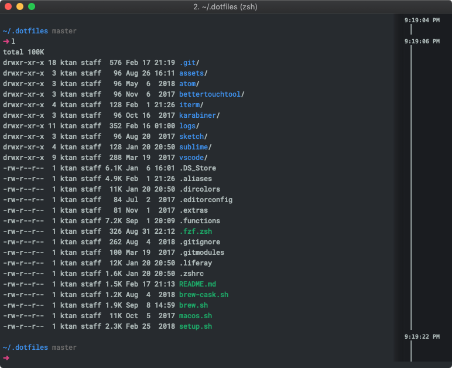
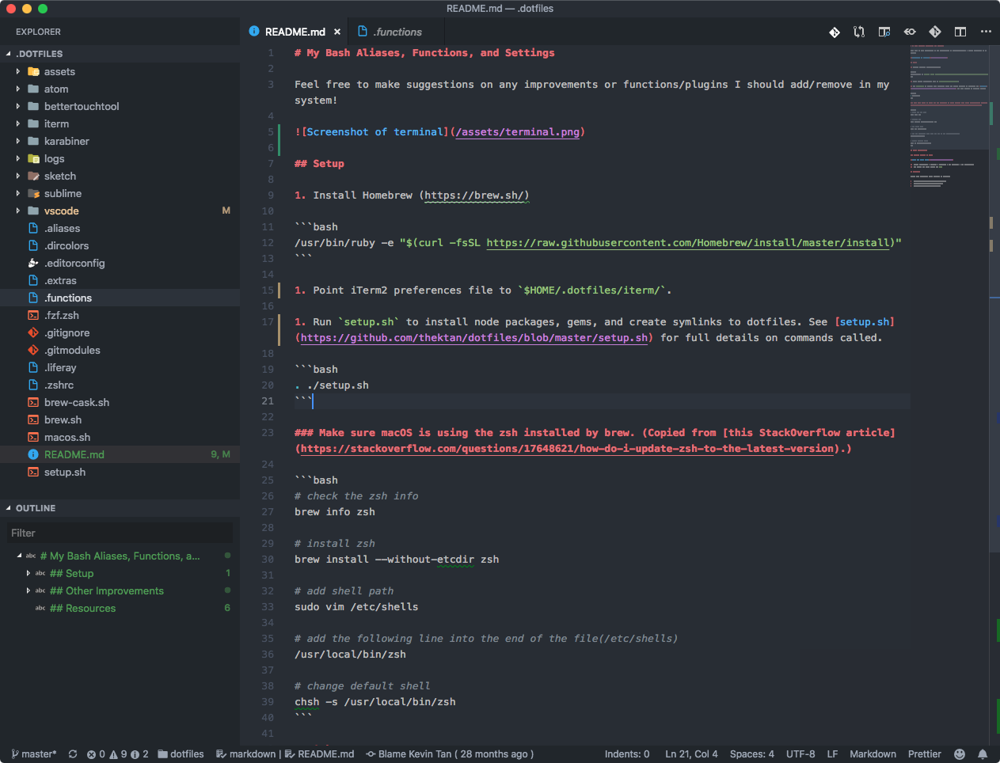

# My Configuration Files

## Screenshots

| iTerm2                                                                     | VS Code                                                                 |
| -------------------------------------------------------------------------- | ----------------------------------------------------------------------- |
|  |  |

## Steps

1. Install [Homebrew](https://brew.sh/)
1. `brew install git`
1. `git clone https://github.com/thektan/dotfiles.git`
1. `. ./setup.sh`
1. Point iTerm2 preferences file to `$DOTFILES/iterm/`
1. In iTerm2, import `ktan-one-dark` color preset

## Other Improvements

### Disable media keys controlling in Chrome

1. Visit `chrome://flags/#hardware-media-key-handling` in Chrome
1. Set to `disabled`
1. Relaunch Chrome

### Improve pasting in MacOS


1. System Preferences > Keyboard > Shortcuts > App Shortcuts > All Applications
2. Add "Paste and Match Style" for `⌘V`

### Improve vscode editor colors

These are my tweaked colors to match Atom's One Dark with the git colors. I have the following in the vscode `settings.json`.

```json
"workbench.colorCustomizations": {
    "editorGutter.addedBackground": "#348f68",
    "activityBar.background": "#282c34",
    "editorGutter.deletedBackground": "#ac4243",
    "gitDecoration.ignoredResourceForeground": "#646572",
    "editorGutter.modifiedBackground": "#a59167",
    "diffEditor.insertedTextBackground": "#2d4d3f",
    "diffEditor.removedTextBackground": "#4d3232",
    "editorOverviewRuler.addedForeground": "#348f68",
    "editorOverviewRuler.deletedForeground": "#ac4243",
    "editorOverviewRuler.modifiedForeground": "#a59167",
    "sideBar.foreground": "#a0a5b1"
}
```

## Notes

-   Create an `.extras` file in the root directory of this repo for any aliases/functions unique to the current workspace. This file is ignored from git.

## Resources

Places I've referenced while creating my dotfiles.

-   https://github.com/mathiasbynens/dotfiles
-   https://github.com/paulirish/dotfiles
-   https://github.com/holman/dotfiles

Color `echo`:
-   https://misc.flogisoft.com/bash/tip_colors_and_formatting
